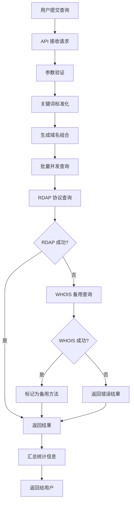
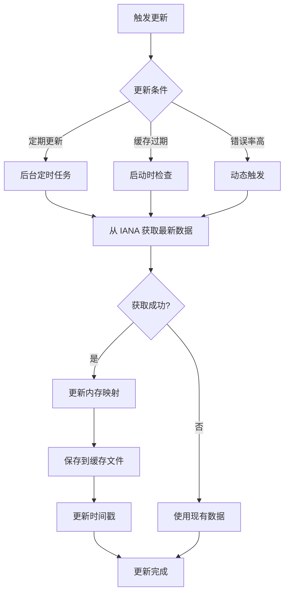

# 域名查询系统架构文档

## 1. 系统概述

### 1.1 项目简介
域名查询系统是一个基于 Next.js 的全栈应用，提供实时域名可用性检查服务。系统采用现代化的 RDAP（Registration Data Access Protocol）协议作为主要查询方式，并提供 WHOIS 协议作为备用方案。

### 1.2 核心功能
- **批量域名查询**：支持多个关键词与多个顶级域名（TLD）的组合查询
- **实时可用性检测**：基于 RDAP 协议的高效域名状态检查
- **智能缓存机制**：本地缓存 TLD 配置信息，减少外部 API 调用
- **容错处理**：RDAP 失败时自动降级到 WHOIS 查询
- **国际化支持**：多语言界面支持

### 1.3 技术栈
- **前端框架**：Next.js 14 (App Router)
- **开发语言**：TypeScript
- **样式框架**：Tailwind CSS + Shadcn UI
- **状态管理**：React Context
- **国际化**：next-intl
- **网络协议**：RDAP + WHOIS (备用)

## 2. 系统架构

### 2.1 整体架构图
```
┌─────────────────────────────────────────────────────────────┐
│                    前端层 (Frontend)                         │
├─────────────────────────────────────────────────────────────┤
│  Next.js App Router  │  React Components  │  Tailwind CSS   │
│  国际化 (next-intl)  │  状态管理 (Context) │  UI组件库       │
└─────────────────────────────────────────────────────────────┘
                                │
                                ▼
┌─────────────────────────────────────────────────────────────┐
│                    API 层 (Backend)                         │
├─────────────────────────────────────────────────────────────┤
│  /api/domain-check   │  /api/domains/tlds  │  Next.js API   │
│  域名查询接口        │  TLD列表接口        │  Routes         │
└─────────────────────────────────────────────────────────────┘
                                │
                                ▼
┌─────────────────────────────────────────────────────────────┐
│                   服务层 (Services)                         │
├─────────────────────────────────────────────────────────────┤
│           DomainCheckService (核心服务)                     │
│  ┌─────────────────┬─────────────────┬─────────────────┐   │
│  │   RDAP 查询     │   WHOIS 查询    │   缓存管理      │   │
│  │   (主要方式)    │   (备用方式)    │   (本地存储)    │   │
│  └─────────────────┴─────────────────┴─────────────────┘   │
└─────────────────────────────────────────────────────────────┘
                                │
                                ▼
┌─────────────────────────────────────────────────────────────┐
│                   数据层 (Data)                             │
├─────────────────────────────────────────────────────────────┤
│  本地缓存文件      │  IANA RDAP API   │  WHOIS 服务器     │
│  rdap-cache.json   │  (外部数据源)    │  (备用数据源)     │
└─────────────────────────────────────────────────────────────┘
```

### 2.2 技术架构特点
- **微服务化设计**：各组件职责明确，松耦合
- **多协议支持**：RDAP + WHOIS 双重保障
- **智能缓存**：减少外部依赖，提升响应速度
- **容错机制**：多层级错误处理和降级策略
- **性能优化**：并发查询 + 批量处理

## 3. 核心组件详解

### 3.1 DomainCheckService (核心服务)

#### 3.1.1 职责概述
`DomainCheckService` 是系统的核心服务类，负责：
- TLD 配置管理和缓存
- RDAP 协议查询实现
- WHOIS 协议备用查询
- 查询结果统一处理

#### 3.1.2 关键方法
```typescript
class DomainCheckService {
  // 服务初始化
  async initialize(): Promise<void>
  
  // 批量域名检查
  async checkDomains(keywords: string[], tlds: string[]): Promise<DomainCheckResult[]>
  
  // RDAP 协议查询
  private async checkSingleDomainRdap(domain: string, tld: string): Promise<DomainCheckResult>
  
  // WHOIS 协议查询 (备用)
  private async checkSingleDomainWhois(domain: string, whoisServer: string, availablePattern: string, tld: string): Promise<DomainCheckResult>
  
  // 获取可用 TLD 列表
  getEnabledTlds(): TldConfig[]
}
```

#### 3.1.3 缓存机制
- **缓存文件**：`app/data/rdap-cache.json`
- **缓存内容**：TLD 到 RDAP 服务器的映射关系
- **更新策略**：
  - 启动时检查缓存有效性
  - 30天过期自动更新
  - 错误率过高时触发更新
  - 定期后台更新（生产环境：7天，开发环境：1天）

### 3.2 TldModel (数据模型)

#### 3.2.1 核心接口定义
```typescript
// TLD 基础信息
interface Tld {
  name: string;           // TLD 名称，如 "com"
  rdapServers: string[];  // RDAP 服务器列表
  displayName?: string;   // 显示名称，如 ".com"
  whoisServer?: string;   // WHOIS 服务器
  availablePattern?: string; // 可用性判断模式
  enabled?: boolean;      // 是否启用
}

// TLD 配置信息
interface TldConfig {
  name: string;
  server: string;
  availablePattern: string;
  enabled: boolean;
  displayName: string;
}

// 域名查询结果
interface DomainCheckResult {
  domain: string;         // 域名
  available: boolean;     // 是否可用
  tld: string;           // 顶级域名
  timestamp: number;      // 查询时间戳
  error?: string;        // 错误信息
  rdapData?: any;        // RDAP 响应数据
  method?: 'RDAP' | 'WHOIS' | 'WHOIS (RDAP fallback)' | 'Unknown';
}
```

### 3.3 API 路由设计

#### 3.3.1 域名查询接口
**路径**：`/api/domain-check`

**GET 请求**：获取可用 TLD 列表
```typescript
// 响应格式
{
  success: boolean;
  tlds: Array<{name: string, displayName: string}>;
  method: string;
  timestamp: string;
}
```

**POST 请求**：批量域名查询
```typescript
// 请求格式
{
  keywords: string[];  // 关键词列表
  tlds: string[];     // TLD 列表
}

// 响应格式
{
  success: boolean;
  method: string;
  results: DomainCheckResult[];
  stats: {
    total: number;
    available: number;
    unavailable: number;
    errors: number;
    methods: Record<string, number>;
    executionTime: number;
  };
  limitApplied: boolean;
  timestamp: string;
}
```

#### 3.3.2 TLD 信息接口
**路径**：`/api/domains/tlds`

**GET 请求**：获取完整 TLD 信息
```typescript
// 响应格式
{
  success: boolean;
  count: number;
  data: Tld[];
  timestamp: string;
  source: string;
}
```

## 4. 数据流程

### 4.1 系统初始化流程
```mermaid
graph TD
    A[系统启动] --> B[DomainCheckService.initialize()]
    B --> C{缓存文件存在?}
    C -->|是| D[加载缓存数据]
    C -->|否| E[从 IANA 获取数据]
    D --> F{缓存是否过期?}
    F -->|否| G[使用缓存数据]
    F -->|是| E
    E --> H[保存到缓存文件]
    H --> I[生成 TLD 配置]
    G --> I
    I --> J[启动定期更新任务]
    J --> K[服务就绪]
```

### 4.2 域名查询流程


### 4.3 缓存更新流程


## 5. 性能优化策略

### 5.1 并发控制
- **批量处理**：每批处理 5 个域名，避免过载
- **超时控制**：
  - RDAP 查询：10秒超时
  - WHOIS 查询：5秒连接 + 5秒数据接收
  - 启动时更新：5秒超时

### 5.2 缓存策略
- **本地文件缓存**：减少外部 API 调用
- **内存缓存**：TLD 配置常驻内存
- **智能更新**：基于错误率的动态更新

### 5.3 容错机制
- **多协议支持**：RDAP 主要 + WHOIS 备用
- **错误重试**：多个 RDAP 服务器轮询
- **降级策略**：服务不可用时的优雅降级

## 6. 安全考虑

### 6.1 输入验证
- **关键词清理**：移除特殊字符，标准化格式
- **数量限制**：关键词和 TLD 数量上限控制
- **格式验证**：确保生成有效的域名格式

### 6.2 请求限制
- **并发控制**：限制同时进行的查询数量
- **超时保护**：防止长时间阻塞
- **资源保护**：避免系统资源耗尽

### 6.3 错误处理
- **统一错误格式**：标准化的错误响应
- **敏感信息保护**：不暴露内部系统信息
- **日志记录**：详细的操作日志用于问题排查

## 7. 监控与维护

### 7.1 性能监控
- **查询响应时间**：跟踪 API 响应性能
- **成功率统计**：监控 RDAP/WHOIS 查询成功率
- **错误率分析**：识别问题模式和趋势

### 7.2 数据维护
- **缓存更新日志**：记录缓存更新历史
- **TLD 变更跟踪**：监控 IANA 数据变化
- **服务器状态检查**：定期验证 RDAP 服务器可用性

### 7.3 系统健康检查
- **服务初始化状态**：确保服务正常启动
- **外部依赖检查**：验证 IANA API 可用性
- **缓存文件完整性**：检查缓存数据有效性

## 8. 部署与扩展

### 8.1 部署要求
- **Node.js 环境**：支持 ES2020+ 特性
- **文件系统权限**：缓存文件读写权限
- **网络访问**：能够访问 IANA API 和 WHOIS 服务器

### 8.2 扩展性考虑
- **水平扩展**：支持多实例部署
- **缓存共享**：可扩展为分布式缓存
- **协议扩展**：易于添加新的查询协议

### 8.3 配置管理
- **环境变量**：支持不同环境的配置
- **功能开关**：可控制的功能启用/禁用
- **性能调优**：可配置的超时和并发参数

## 9. 未来改进方向

### 9.1 功能增强
- **历史查询记录**：用户查询历史管理
- **域名监控**：定期检查域名状态变化
- **批量导出**：查询结果的多格式导出

### 9.2 性能优化
- **分布式缓存**：Redis 等外部缓存系统
- **CDN 集成**：静态资源加速
- **数据库集成**：持久化存储查询结果

### 9.3 用户体验
- **实时更新**：WebSocket 实时查询状态
- **智能推荐**：基于查询历史的域名推荐
- **可视化分析**：查询结果的图表展示

---

*本文档基于当前系统实现编写，随着系统演进可能需要相应更新。* 